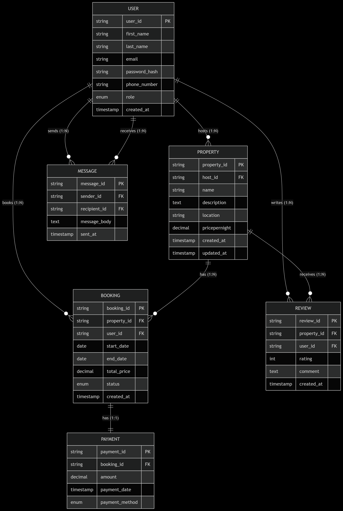

Partial Dependency	Property	host_id depends on user_id (but no direct violation yet).
Transitive Dependency	Booking	total_price can be derived from pricepernight in Property and end_date - start_date.
Redundancy	Review	user_id and property_id already exist in Booking.

